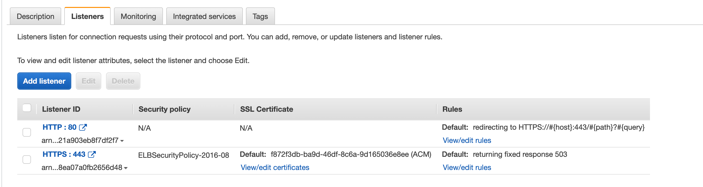
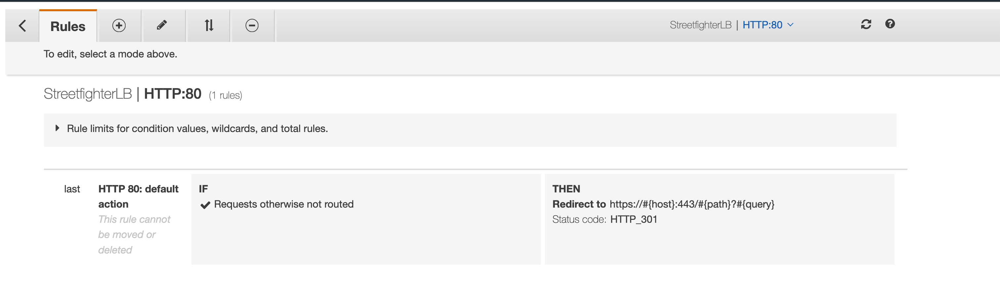
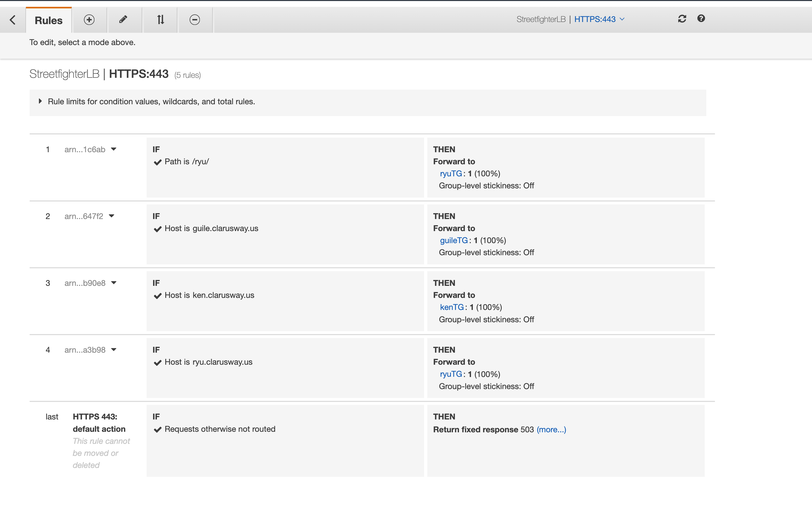

## ALB Port Forwarding Using Listener Rules

NOTE: We are going to configure the using of the same default HTTPS port on three website applications.

1. Clone Github Repo on your local
2. Create 4 Security Group like this
```text
Security Group Name : ALBSecGroup
Description         : ALB Security Group
VPC                 : Default VPC
Inbound Rules:
    - Type: HTTP ---> Source: Anywhere
    - Type: HTTPS ---> Source: Anywhere
    - Type: TCP ---> Port:3000 ---> Source: EC2SecGroup
    - Type: TCP ---> Port:4000 ---> Source: EC2SecGroup
    - Type: TCP ---> Port:5000 ---> Source: EC2SecGroup
Outbound Rules: Keep it as it is
Tag:
    - Key   : Name
      Value : ALB SEC Group


Security Group Name : EC2SecGroup
Description         : EC2 Security Group
VPC                 : Default VPC
Inbound Rules:
    - Type: SSH ----> Source: Anywhere
    - Type: TCP ---> Port:3000 ---> Source: ALBSecGroup
    - Type: TCP ---> Port:4000 ---> Source: ALBSecGroup
    - Type: TCP ---> Port:5000 ---> Source: ALBSecGroup
Outbound Rules: Keep it as it is
Tag:
    - Key   : Name
      Value : EC2 SEC Group
```
3. Create 2 instance for RYU, 2 instances for KEN, 2 instance for GUILE using userdatas inside the  website-1, website-2, website-3 folders. Attach the EC2SecGroup

4. Change their publishing ports RYU ---> 3000, KEN ---> 4000, GUILE ---> 5000 using /etc/nginx/nginx.conf folder 
```bash
server {
        listen       5000;
        listen       [::]:5000;
        server_name  _;
        root         /usr/share/nginx/html;

        # Load configuration files for the default server block.
        include /etc/nginx/default.d/*.conf;

        error_page 404 /404.html;
        location = /404.html {
        }

        error_page 500 502 503 504 /50x.html;
        location = /50x.html {
        }
    }
```

restart nginx app for
```bash
systemctl restart nginx
```

5. Create RyuTG, KenTG, GuileTG
Create TG for each app and set their ports as following port

6. Create Application Load Balancer using created Target groups and port forwarding listener rules

7. Create A Record and redirect traffic to the sub path determined for each app



